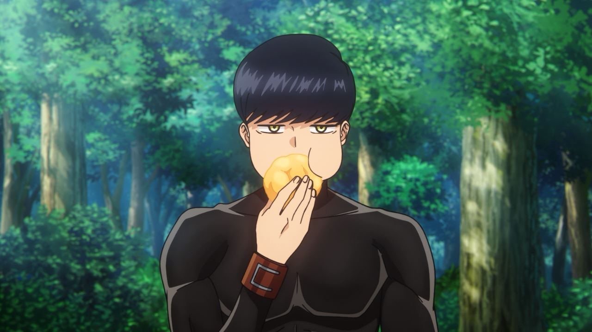

# Level 1


Mash Burnedead hidup di dunia di mana sihir adalah segalanya. Meskipun dia tidak memiliki kemampuan sihir, dia memiliki kekuatan fisik yang luar biasa. 


Karena Mash payah dalam berhitung, jadi dia membuat program Python untuk melacak latihan fisiknya dan menggunakan Git untuk mengelola versi programnya.

Pertama, Mash membuat repositori Git baru dan membuat branch. 
Selanjutnya dia menambahkan file `mashcise.py` ke branch `master`.

.png)

Rupanya mash salah mengupload file python, akhirnya mash lebih memilih mengupload secara langsung filenya yang benar pada GitHub. 
```python
#mashcise

def record_exercise():
    return 0
def track_progress():
    return 0
```

.png)

Setelah Mash menambahkan file baru di branch `master`, dia menyadari bahwa dia ingin mengambil perubahan terbaru dari branch `master` di GitHub. Dia melakukan ini dengan perintah git pull.

```bash
git pull
```

.png)

Kemudian, dia membuat branch `development` dan menambahkan baris kode baru pada mashcise.py.

```bash
git checkout -b development
```

```python
#mashcise

def record_exercise(exercise_type, reps):
    return {"type": exercise_type, "reps": reps}

def track_progress(exercise_records):
    return progress
```

Kemudian dia melakukan commit dan push pada branch `development`.
```bash
git add .
git commit
git push origin development
```

.png)

Selanjutnya yang dia lakukan adalah membuat branch `featureA`.

```bash
git checkout -b featureA
```

.png)

Pada branch `featureA`, Mash menulis fungsi untuk mencatat latihan fisiknya.

```python
def record_exercise(exercise_type, reps):
    print(f"Recording exercise: {exercise_type}, {reps} reps")
    return {"type": exercise_type, "reps": reps}
```


.png)

Setelah itu, dia melakukan commit dan push ke branch `featureA`.

Kemudian mash bingung terhadap fungsi track_progress(), akhirnya dia memutuskan untuk menghapusnya dulu pada branch `development`
```bash
git checkout development
```

Lalu commit dan push ke branch `development`.

Selanjutnya dia baru sadar lupa menghitung berapa sets yang dilakukannya untuk setiap olahraga, sehingga mash harus memperbaiki kodenya. Mash kembali ke branch `featureA` kemudian memperbaiki kodenya

```python
def record_exercise(exercise_type, sets, reps):
    print(f"Recording exercise: {exercise_type}, {sets} sets, {reps} reps")
    return {"type": exercise_type, "sets": sets, "reps": reps}
```

.png)

Setelah memakan kue sus isi krim, akhirnya Mash tau apa yang harus dia tulis pada fungsi untuk melacak perkembangan latihan fisiknya sehingga dia membuat branch `featureB`. 



Karena Mash takut ide ini segera hilang, maka kemudian dia menyimpan perubahan sebelumnya kedalam stash.

Mula-mula dia melihat perubahan yang belum dicommit.
```bash
git diff
```

.png)

Setelah memastikan memang ada perubahan, kemudian baru dia menggunakan stash.

```bash
git stash save "wip record_exercise"
```

.png)

Kemudian dia membuat branch `featureB`

```bash
git checkout development
git checkout -b featureB
```

.png)

Pada branch `featureB`, Mash menulis fungsi untuk melacak perkembangan latihan fisiknya, namun karena terlalu lama dia sudah lupa dengan idenya tadi sehingga Mash hanya menuliskan sebagai berikut.

```python
def track_progress(exercise_records):
    progress = {}
    return progress
```

Dia melakukan commit dan push ke branch `featureB`.

.png)


Setelah itu, dia beralih ke branch `featureA` dan mengerjakan kembali progress nya yang sebelumnya disimpan di stash.

```bash
git checkout `featureA`
git stash list
git stash pop
```

.png)


Kemudian Mash melakukan commit dan push ke branch `featureA`.

.png)


Mash beralih ke branch `development` dan melakukan merge dari branch `featureA`.

```bash
git checkout development
git merge featureA --no-ff
```

.png)

Karena terdapat konflik, maka mash harus menyelesaikan konflik ini terlebih dahulu. Karena Mash ingin menerima perubahan dari `featureA` maka pada VS Code klik accept incoming change.

.png)

Setelah tidur siang, mash memperoleh ide untuk logika fungsi untuk melacak latihan fisiknya. Dia langsung mengeksekusi idenya ini.
```bash
git checkout featureB
```

```python
def track_progress(exercise_records):
    progress = {}
    total_sets = 0
    total_reps = 0
    for record in exercise_records:
        if record["type"] not in progress:
            progress[record["type"]] = {"sets": record["sets"], "reps": record["reps"]}
        else:
            progress[record["type"]]["sets"] += record["sets"]
            progress[record["type"]]["reps"] += record["reps"]
        total_sets += record["sets"]
        total_reps += record["reps"]
```

Kemudian dia melakukan commit dan push ke branch `featureB`.

.png)

Mash juga kepikiran untuk menambahkan beberapa kode lain.

```python
if total_reps == 0:
        return "You haven't done any reps yet!"
    elif total_reps < 0:
        return "Wait, how did you do negative reps?"
    else:
        return progress
```

.png)

Tapi karena Mash merasa kodenya ini ditertawakan oleh temannya, dia merasa malu kemudian. Tapi sebelumnya mash sudah terlanjut melakukan commit, akhrinya dia melakukan git reset untuk membatalkan commit terakhirnya.

```bash
git reset --hard HEAD~1
```

.png)

Kemudian beralih ke branch `development`. Mash menambahkan beberapa baris kode agar aplikasinya terlihat lebih interaktif.
```python
print("Welcome to Mashcise!")
print("Let's record your exercises.\n")

exercise_records = []
while True:
    exercise_type = input("Enter exercise type (or 'done' to finish): ")
    if exercise_type.lower() == 'done':
        break
    sets = int(input("Enter number of sets: "))
    reps = int(input("Enter number of reps per set: "))
    exercise_records.append(record_exercise(exercise_type, sets, reps))
```

.png)

Setelah mendapatkan ide untuk logika fungsi pelacakan latihan fisiknya, Mash memutuskan untuk menambahkan beberapa baris kode lagi di branch `featureB`.

```bash
git checkout featureB
```

```python
print("\nYour Progress:")
for exercise, data in progress.items():
    print(f"- {exercise}: {data['sets']} sets, {data['reps']} reps")
print(f"\nTotal: {total_sets} sets, {total_reps} reps")

return progress
```

Dia melakukan commit dan push perubahan ini ke branch `featureB`.

```bash
git add featureB.py
git commit -m "progress tracking and display"
git push origin featureB
```

.png)

Setelah itu, Mash beralih ke branch `development` dan melakukan merge dari branch `featureB`.

```bash
git checkout development
git merge featureB --no-ff
```

.png)

Karena konfliknya terlalu banyak, maka pada VS Code pilih "Resolve in Merge Editor". Sesuaikan sesuai dengan bagaimana seharusnya kemudian commit dan push ke branch development.

.png)

Mash lupa untuk memanggil fungsi track_progress(), sehingga dia harus mengedit kode nya terlebih dahulu kemudian melakukan commit dan push lagi.
```python
print("\nRecording completed.\n")
track_progress(exercise_records)
```

.png)

Terakhir Mash melakukan merge dari branch `development` dan `master`

.png)

Akhirnya, Mash berhasil membuat program Python untuk melacak latihan fisiknya dengan bantuan Git. Mash berharap bahwa dengan adanya fungsi pelacakan ini, dia akan dapat melihat progres latihannya dengan lebih baik.

# Soal
1. Soal 1
```
Buat sebuah repository di GitHub. Nama repository dalam format ajk-[nama panggilan]-penugasan1. Repository ini juga sebagai tempat menaruh laporan pengerjaan untuk level selanjutnya.
Contoh: ajk-nur-penugasan1
Struktur: 
/src			(Berisi kode pengerjaan level 1 kalian)
README.md		(Readme utama)
level-1.md		(Laporan level 1)
level-2.md		(Laporan level 2)
level-3.md		(Laporan level 3)
level-4.md		(Laporan level 4)
```

Untuk mengejakan soal ini cukup dengan membuat repository baru pada GitHub kemudian menambahkan file serta folder sesuai dengan instruksi pada soal.

.png)

2. Soal 2
```
Implementasikan penggunaan branching yang terdiri dari master, development, featureA, dan featureB. Codebase dibebaskan.
```

Pada soal ini diminta untuk mengimplementasikan branching. Langkah yang saya lakukan adalah menambahkan branch master, development, featureA, dan featureB sesuai dengan alur skenario pada narasi diatas.

.png)

3. Soal 3
```
Implementasikan intruksi git untuk push, pull, stash, reset, diff, dan merge. Adanya tambahan intruksi git selain yang disebutkan akan lebih baik.
```
- push
.png)
Salah satu contoh ketika saya melakukan git push untuk men-transfer perubahan file ke repository GitHub.

- pull
.png)
Pada kasus ini, git pull saya gunakan untuk mengambil perubahan terbaru dari repository GitHub.

- stash
.png)
Stash pada kasus ini digunakan ketika saya ingin berpindah ke branch lain namun masih ada perubahan yang belum di-commit pada brach saat ini. Sehingga saya menggunakan git stash save untuk menyimpan perubahan tersebut sehingga bisa berpindah branch. 

- reset
.png)
Ketika sudah terlanjut melakukan commit, namun kemudian merasa perubahannya kurang cocok, maka disitu dapat mengimplementasikan reset untuk kembali ke commit sebelumnya.

- diff
.png)
Disini saya menggunakan git diff untuk memastikan adanya perubahan pada branch saat ini sebelum melakukan git stash. 

- merge
.png)
Saya menggunakan merge disini saat ingin menggabungkan branch development ke branch master.

4. Soal 4
```
Implementasikan sebuah penanganan conflict di branch development ketika setelah merge dari branch featureA lalu merge dari branch featureB.
Catatan: conflict bisa terjadi jika kedua branch mengerjakan di file dan line code yang sama. Buatlah skenario sendiri.
```
Ketika ingin melakukan merge dari branch featureB ke branch development, disini menghadapi conflict karena kedua branch membuat perubahan pada file dan line code yang sama. Sehingga perlu fix conflict terlebih dahulu. 

.png)

Pada kasus ini saya memutuskan untuk menyelesaikan conflict nya pada Merge Editor di VS Code untuk mempermudah pengeditan dan menyesuaikannya sesuai dengan kebutuhan. Ketika sudah selesai, klik Complete Merge pada VS Code kemudian commit dan push.

.png)

5. Soal 5
```
Gunakan merge no fast forward.
```
.png)

Merge no fast forward digunakan pada merge antara 2 branch ini. 

# Git Graph

.png)

# Kendala atau Kesulitan
- Kendala utama adalah saat membuat skenario untuk mengimplementasikan instruksi Git. Dan juga karena kurang familiar dengan Git dan GitHub, jadi selama pengerjaan sering menghadapi error-error sehingga perlu waktu lebih untuk mencari solusinya.